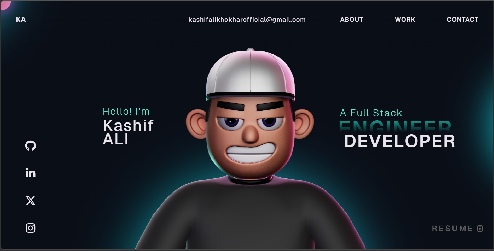

# Kashif Ali Portfolio 🚀

A modern, responsive, and high-performance portfolio website built with React, TypeScript, and 3D technologies.



## About Me 👋

I'm **Kashif Ali**, a Full-Stack Developer and Computer Science student at Superior University (2023 - 2027). I have a passion for turning ideas into scalable web applications and solving complex coding challenges. I thrive on constantly learning and exploring new technologies to build impactful solutions.

## Features ✨

- 🧑‍🎨 **Interactive 3D character** rendered with Three.js / React Three Fiber that reacts to cursor movement.
- 🌀 **Buttery smooth scrolling** powered by GSAP ScrollSmoother, with scroll-scrubbed hero animations.
- 🪄 **Physics-driven tech stack** — floating skill balls simulated with Rapier physics.
- 📊 **Live GitHub section** showing real contributions, top repositories, and profile stats.
- 📱 **Fully responsive** — tuned from large desktops down to small phones, with a polished mobile nav drawer.
- ✉️ **Working contact form** and a custom animated cursor.
- ⚡ **Performance-focused** — capped device pixel ratio, gated WebGL render loops, and lean scroll handlers.

## Featured Projects 🏗️

- **SkyCast Elite** - [Live](https://sky-cast-nine-theta.vercel.app/)  
  Weather Intelligence app built with React, TypeScript, and OpenWeather API.
- **Timetable Generator** - [Live](https://timetable-generator-five.vercel.app/)  
  Academic tool for efficient schedule management.
- **Superior GPA Calculator** - [Live](https://superior-gpa-calculator-phi.vercel.app/dashboard)  
  Academic tool built with Tailwind CSS for students.
- **Currency PRO** - [Live](https://currency-converter-mu-ecru.vercel.app/)  
  Financial tool integrated with Currency API.
- **Velora** - [Live](https://velora-studio-nu.vercel.app/)  
  Event Invitation Studio using Framer Motion.
- **PrismConvert** - [Live](https://prism-convert-six.vercel.app/)  
  Image & PDF Tools built with Next.js.
- **CryptoStego** - [Live](https://crypto-stego.vercel.app/)  
  Cybersecurity tool using AES-256 encryption and LSB steganography (React, CryptoJS).

## Professional Experience 💼

- **Full Stack Developer** @ Infinitiv.ai (2026 - Present)  
  Working on AI-powered solutions and optimizing application performance for scalability.
- **Frontend Developer** @ Muasa Solutions (2025)  
  Built responsive user interfaces and interactive features.

## Tech Stack 🛠️

- **Languages:** TypeScript, JavaScript, HTML5, CSS3
- **Frontend:** React, Next.js, Vite, Tailwind CSS, Framer Motion
- **Animations & 3D:** GSAP, Three.js, React Three Fiber
- **Backend & Database:** Node.js, Express.js, MongoDB, MySQL
- **Tools:** Git, GitHub, VS Code, Vercel

## Contact & Connect 🔗

- 📧 **Email:** [kashifalikhokharofficial@gmail.com](mailto:kashifalikhokharofficial@gmail.com)
- 🐙 **GitHub:** [@Kashif-Khokhar](https://github.com/Kashif-Khokhar)
- 💼 **LinkedIn:** [Kashif Ali Khokhar](https://www.linkedin.com/in/kashif-ali-khokhar/)
- 🐦 **Twitter/X:** [@Kashif_Khokhar1](https://x.com/Kashif_Khokhar1)
- 📸 **Instagram:** [@malik._.kashif_khokhar_](https://www.instagram.com/malik._.kashif_khokhar_/?hl=en)


## Getting Started 🚀

```bash
# Clone the repository
git clone https://github.com/Kashif-Khokhar/Kashif-Portfolio.git
cd Kashif-Portfolio

# Install dependencies
npm install

# Start the dev server
npm run dev

# Create a production build
npm run build

# Preview the production build
npm run preview
```

The app runs on Vite — the dev server starts at `http://localhost:5173` by default.

## License

This project is open source and available under the [MIT License](LICENSE).
